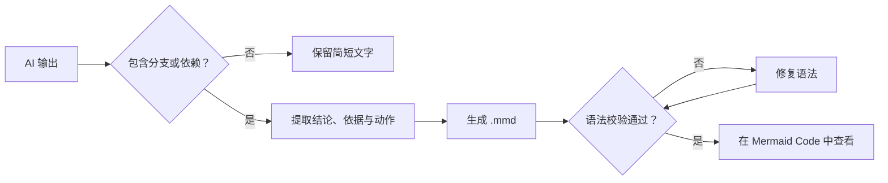
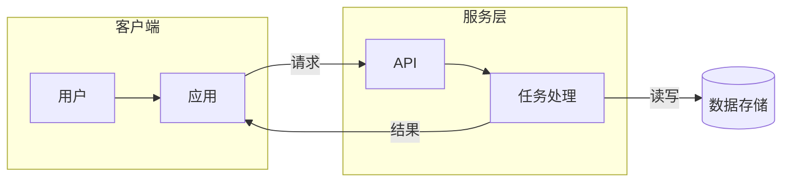
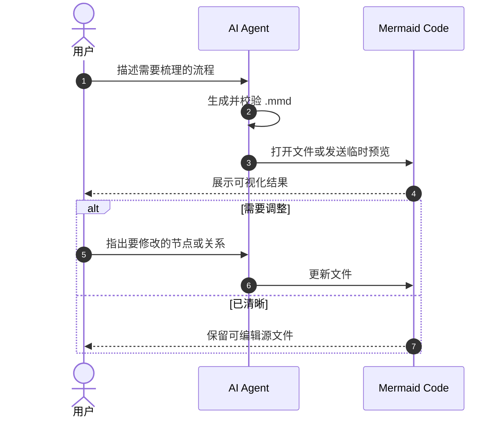
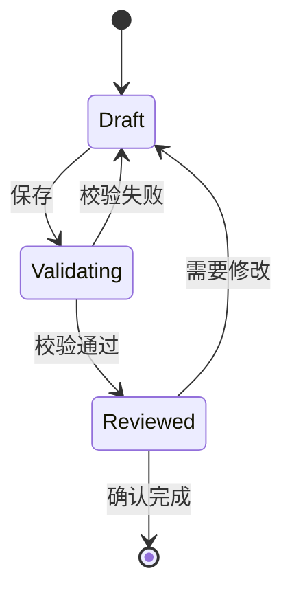
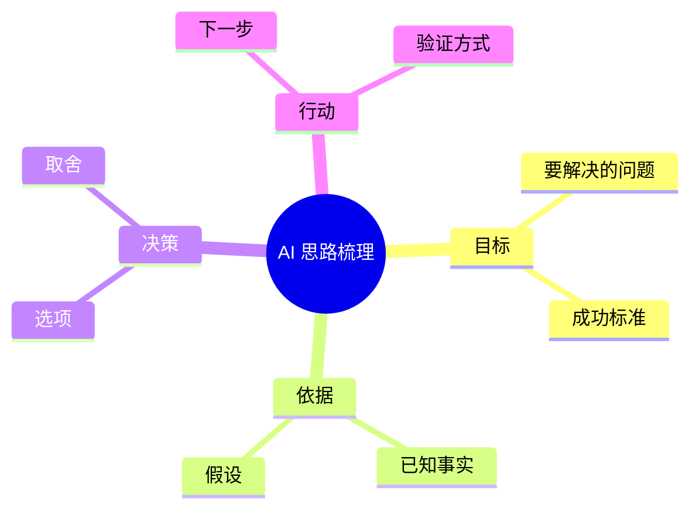

# Mermaid authoring reference

Standalone `.mmd` files contain raw Mermaid text. They do not contain Markdown fences or surrounding prose.

## Selection and defaults

| Need | Syntax | Default direction |
| --- | --- | --- |
| Workflow, decision tree, dependencies, data flow | `flowchart` | `LR` for short process; `TD` for hierarchy, long labels, or 10+ nodes |
| Calls, handoffs, protocol behavior | `sequenceDiagram` | time runs top to bottom |
| Lifecycle and allowed transitions | `stateDiagram-v2` | automatic |
| Topic hierarchy or brainstorming | `mindmap` | radial |
| Dates and delivery plan | `gantt` | time runs left to right |
| Event history | `timeline` | time runs left to right |

Prefer a `flowchart` with `subgraph` boundaries for architecture diagrams because it is broadly supported and easy to edit.

## Flowchart template



Useful shapes:

```text
step["过程"]
decision{"判断"}
data[("数据")]
terminal(["开始或结束"])
external[["外部系统"]]
```

Use explicit edge labels for branches: `decision -->|是| next`. Use dotted arrows such as `-.->` only for secondary or inferred relationships. A visible return edge should explain the feedback condition.

## Architecture or data-flow template



Boundaries should represent ownership, trust zones, deployment units, or stages. Do not group merely to add color.

## Sequence template



Use `->>` for a call, `-->>` for a response, `Note over A,M:` for a short constraint, and `loop`, `alt`/`else`, `opt`, or `par` only when the control structure matters.

## State template



States are nouns or durable conditions; transition labels are events or guards. If the main concern is work steps rather than valid transitions, use a flowchart instead.

## Mind map template



Mind-map structure is indentation-sensitive. Use it for hierarchy, not for ordered execution.

## Readability and syntax safety

- Use ASCII IDs such as `validate` and put Chinese or punctuation in quoted labels: `validate["校验结果"]`.
- Avoid reserved or ambiguous bare words. In particular, quote labels containing `end`, colons, brackets, parentheses, or Markdown-like punctuation.
- Define each node once when possible, then connect by ID.
- Keep labels short: one idea per node, usually under 16 Chinese characters or 8 English words.
- Use at most two or three visual classes. Semantics come before styling.
- Do not invent relationships. Mark uncertain items explicitly as `假设` or with a dotted edge.
- Prefer several small diagrams over a single wall-sized graph.
- Validate with the current Mermaid CLI because renderers embedded in other products may support different Mermaid versions.

Official syntax index: <https://mermaid.js.org/intro/syntax-reference.html>

A validated standalone example is available at [examples/ai-workflow.mmd](examples/ai-workflow.mmd).
